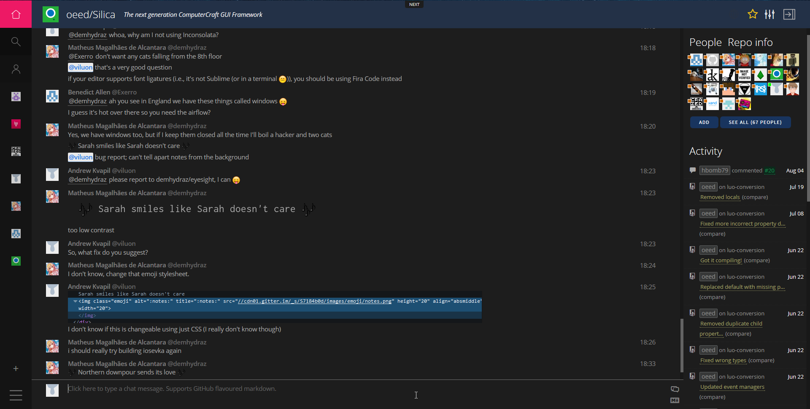

# Gitter Dark

A dark [Stylish theme](https://userstyles.org/styles/131747/gitter-dark-by-viluon) for [Gitter.im](https://gitter.im).

## Contributors, Licensing and History
This style is an adaptation of [ylluminarious' Dark Gitter](https://userstyles.org/styles/121640/ylluminarious-s-dark-gitter), which is an improvement over [MATU's Dark Gitter](https://userstyles.org/styles/112547/matu-s-dark-gitter), which was in turn derived from [Dark Gitter by RampantLeaf](https://userstyles.org/styles/112545/dark-gitter).

This row of forks used (apart from [ylluminarious](https://userstyles.org/users/301252), who ignored the license terms) the original [CC-BY-SA 4.0](https://creativecommons.org/licenses/by-sa/4.0/), and Gitter Dark by viluon is no exception.

The original Gitter Dark by viluon was a direct edit of ylluminarious' version, surprisingly by @[viluon](https://github.com/viluon). Major changes were introduced after the style was released to [userstyles.org](https://userstyles.org/), when @[Exerro](https://github.com/Exerro) suggested many improvements to the theme.

## Code Quality
I hate to say it, but the style itself is terrible. This is due to 3 main reasons:
* It's CSS, ugly by default
* The Gitter CSS itself is incredibly ugly, the buttons, for example, are each a different class (even though they look alike)
* The previous contributors left the code in an inconsistently space-indented mess

Also note that I am not a web developer and am generally unskilled with CSS&Co. I'm sorry for that :/

PRs with code improvements are very welcomed!
